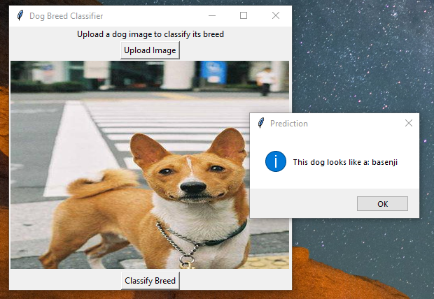

# Dog_Breed_Identification_ML
A Python Tkinter application that classifies dog breeds using Tensorflow and Transfer Learning (ResNet50 = a pre-trained model)

## Features
- Upload an image of a dog
- Classify its breed (120+ possible breeds)
- Tkinter GUI for easy use

# Use
python dog_breed_model.py

python main.py

  
